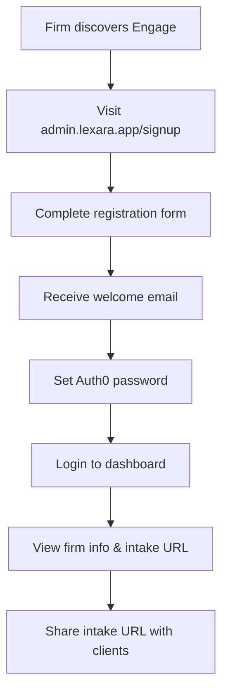

# Admin System Specification - Law Firm Dashboard

## 🎯 **MVP Admin System Overview**

**Domain**: `admin.lexara.app`  
**Implementation**: Separate Cloudflare Worker  
**Architecture**: Server-side rendered HTML with Auth0 integration  
**Target Users**: Law firm administrators and staff  

---

## 📋 **Functional Requirements**

### **Core MVP Features**
1. **Self-Service Signup** - Law firms can register independently
2. **Auth0 Protected Login** - Secure authentication for firm access
3. **Basic Dashboard** - Protected page showing firm information
4. **Session Management** - Secure, persistent login sessions

### **User Journey**


---

## 🔧 **Technical Architecture**

### **Deployment Strategy**
- **Separate Worker**: Independent from client intake system
- **Domain**: `admin.lexara.app` with SSL certificate
- **Wrangler Config**: `wrangler-admin.toml` for admin-specific deployment
- **Environment Variables**: Shared Auth0 config, separate secrets if needed

### **File Structure**
```
src/admin/
├── admin-worker.ts           # Main admin worker entry point
├── handlers/
│   ├── signup.ts            # Signup form and processing
│   ├── login.ts             # Auth0 login redirect
│   ├── callback.ts          # Auth0 callback handling
│   ├── dashboard.ts         # Protected dashboard
│   └── settings.ts          # Basic firm settings
├── middleware/
│   ├── auth.ts              # Session-based authentication
│   └── validation.ts        # Form validation utilities
├── templates/
│   ├── signup.html          # Signup form template
│   ├── dashboard.html       # Main dashboard template
│   └── layout.html          # Common HTML layout
└── utils/
    ├── session.ts           # Secure session management
    └── email.ts             # Welcome email functionality
```

---

## 🖥️ **User Interface Specifications**

### **Signup Page (`/signup`)**

#### **Form Fields**
```html
<!-- Firm Information -->
<section class="firm-info">
  <h3>Firm Information</h3>
  <input name="firmName" type="text" required 
         placeholder="Smith & Associates Law"
         pattern="[A-Za-z0-9\s&.,'-]+" 
         maxlength="100">
  
  <input name="subdomain" type="text" required 
         placeholder="smith-associates"
         pattern="[a-z0-9-]+" 
         minlength="3" maxlength="50">
  <small>Your intake URL: https://<span id="preview">subdomain</span>.lexara.app</small>
  
  <select name="practiceArea" required>
    <option value="">Select Primary Practice Area</option>
    <option value="personal_injury">Personal Injury</option>
    <option value="employment_law">Employment Law</option>
    <option value="family_law">Family Law</option>
    <option value="corporate_law">Corporate Law</option>
    <option value="criminal_defense">Criminal Defense</option>
    <option value="real_estate">Real Estate</option>
    <option value="other">Other</option>
  </select>
</section>

<!-- Admin User Information -->
<section class="admin-info">
  <h3>Primary Administrator</h3>
  <input name="adminName" type="text" required 
         placeholder="John Smith"
         maxlength="100">
  
  <input name="adminEmail" type="email" required 
         placeholder="john@smithlaw.com">
  
  <input name="phone" type="tel" 
         placeholder="+1 (555) 123-4567"
         pattern="[\+]?[0-9\s\(\)\-\.]+">
</section>

<!-- Legal Agreement -->
<section class="legal">
  <label class="checkbox-label">
    <input type="checkbox" name="terms" required>
    <span class="checkmark"></span>
    I agree to the <a href="/terms" target="_blank">Terms of Service</a> 
    and <a href="/privacy" target="_blank">Privacy Policy</a>
  </label>
  
  <label class="checkbox-label">
    <input type="checkbox" name="marketing">
    <span class="checkmark"></span>
    Send me updates about new features and legal industry insights
  </label>
</section>
```

#### **Validation Rules**
- **Firm Name**: Required, 3-100 characters, alphanumeric + common punctuation
- **Subdomain**: Required, 3-50 characters, lowercase letters/numbers/hyphens only
- **Admin Email**: Required, valid email format
- **Terms**: Required checkbox
- **Real-time Validation**: Subdomain availability check on blur

#### **Server-Side Processing**
```typescript
interface SignupFormData {
  firmName: string;
  subdomain: string;
  practiceArea: string;
  adminName: string;
  adminEmail: string;
  phone?: string;
  terms: boolean;
  marketing?: boolean;
}

async function handleSignupSubmission(formData: SignupFormData, env: Env) {
  // 1. Server-side validation
  const validation = validateSignupData(formData);
  if (!validation.valid) {
    return renderSignupForm({ errors: validation.errors, formData });
  }
  
  // 2. Check subdomain availability
  const isAvailable = await checkSubdomainAvailability(formData.subdomain, env);
  if (!isAvailable) {
    return renderSignupForm({ 
      errors: { subdomain: 'This subdomain is already taken' }, 
      formData 
    });
  }
  
  // 3. Create Auth0 user
  const auth0User = await createAuth0User({
    email: formData.adminEmail,
    name: formData.adminName,
    userMetadata: {
      firmName: formData.firmName,
      phone: formData.phone
    }
  }, env);
  
  // 4. Create firm record
  const firmId = await createFirmInRegistry({
    name: formData.firmName,
    slug: formData.subdomain,
    practiceAreas: [formData.practiceArea],
    adminAuth0UserId: auth0User.user_id,
    adminEmail: formData.adminEmail,
    adminName: formData.adminName,
    adminPhone: formData.phone
  }, env);
  
  // 5. Send welcome email
  await sendWelcomeEmail({
    email: formData.adminEmail,
    name: formData.adminName,
    firmName: formData.firmName,
    intakeUrl: `https://${formData.subdomain}.lexara.app`,
    loginUrl: 'https://admin.lexara.app/login'
  }, env);
  
  // 6. Redirect to success page
  return Response.redirect('/signup/success', 302);
}
```

### **Dashboard Page (`/dashboard`)**

#### **Layout Structure**
```html
<div class="admin-layout">
  <!-- Header -->
  <header class="admin-header">
    <div class="logo">
      
    </div>
    <div class="firm-info">
      <h1>{{firm.name}}</h1>
      <span class="subtitle">Admin Dashboard</span>
    </div>
    <div class="user-menu">
      <span>{{user.name}}</span>
      <button class="logout-btn">Logout</button>
    </div>
  </header>

  <!-- Main Content -->
  <main class="dashboard-content">
    <!-- Quick Stats -->
    <section class="stats-grid">
      <div class="stat-card primary">
        <h3>Client Intake URL</h3>
        <div class="url-display">
          <code>https://{{firm.slug}}.lexara.app</code>
          <button class="copy-btn" data-copy="https://{{firm.slug}}.lexara.app">
            📋 Copy
          </button>
        </div>
        <p class="help-text">Share this URL with potential clients</p>
      </div>
      
      <div class="stat-card">
        <h3>Conversations This Month</h3>
        <div class="stat-number">{{stats.conversationsThisMonth}}</div>
        <div class="stat-trend">
          <span class="trend-arrow {{stats.trend}}">↗</span>
          <span>{{stats.percentChange}}% from last month</span>
        </div>
      </div>
      
      <div class="stat-card">
        <h3>Active Conversations</h3>
        <div class="stat-number">{{stats.activeConversations}}</div>
        <p class="help-text">Conversations awaiting attorney review</p>
      </div>
    </section>

    <!-- Feature Grid -->
    <section class="features-grid">
      <div class="feature-card available">
        <div class="feature-icon">⚙️</div>
        <h4>Firm Settings</h4>
        <p>Update your firm information, branding, and practice areas</p>
        <a href="/settings" class="feature-btn">Configure</a>
      </div>
      
      <div class="feature-card coming-soon">
        <div class="feature-icon">💬</div>
        <h4>Client Conversations</h4>
        <p>View and manage all client intake conversations</p>
        <span class="badge coming-soon">Coming Soon</span>
      </div>
      
      <div class="feature-card coming-soon">
        <div class="feature-icon">🚫</div>
        <h4>Conflict Management</h4>
        <p>Manage your conflict of interest database</p>
        <span class="badge coming-soon">Coming Soon</span>
      </div>
      
      <div class="feature-card coming-soon">
        <div class="feature-icon">📊</div>
        <h4>Analytics & Reports</h4>
        <p>Track intake performance and conversion metrics</p>
        <span class="badge coming-soon">Coming Soon</span>
      </div>
    </section>

    <!-- Quick Actions -->
    <section class="quick-actions">
      <h3>Quick Actions</h3>
      <div class="action-buttons">
        <button class="action-btn">
          📧 Test Intake Form
        </button>
        <button class="action-btn">
          👥 Invite Team Member
        </button>
        <button class="action-btn">
          🎨 Customize Branding
        </button>
      </div>
    </section>
  </main>
</div>
```

#### **Dashboard Data Requirements**
```typescript
interface DashboardData {
  user: {
    name: string;
    email: string;
    auth0UserId: string;
  };
  firm: {
    firmId: string;
    name: string;
    slug: string;
    practiceAreas: string[];
    intakeUrl: string;
  };
  stats: {
    conversationsThisMonth: number;
    activeConversations: number;
    totalConversations: number;
    percentChange: number;
    trend: 'up' | 'down' | 'flat';
  };
  features: {
    conversations: 'available' | 'coming_soon';
    conflicts: 'available' | 'coming_soon';
    analytics: 'available' | 'coming_soon';
    settings: 'available' | 'coming_soon';
  };
}
```

---

## 🔐 **Authentication & Security**

### **Session Management**
```typescript
interface AdminSession {
  sessionId: string;           // Secure random ID
  auth0UserId: string;         // Auth0 user identifier
  firmId: string;              // Associated firm
  userEmail: string;           // User email for display
  userName: string;            // User name for display
  createdAt: Date;             // Session creation time
  lastActivity: Date;          // Last request time
  expiresAt: Date;             // Session expiration (24 hours)
}

// Session storage in Durable Object or KV
class AdminSessionStore {
  async createSession(auth0UserId: string, firmId: string): Promise<string>;
  async getSession(sessionId: string): Promise<AdminSession | null>;
  async updateActivity(sessionId: string): Promise<void>;
  async deleteSession(sessionId: string): Promise<void>;
}
```

### **Authentication Middleware**
```typescript
async function requireAdminAuth(request: Request, env: Env): Promise<AuthResult> {
  // 1. Extract session cookie
  const sessionId = getCookie(request, 'admin_session');
  if (!sessionId) {
    return { redirect: '/login', reason: 'no_session' };
  }
  
  // 2. Validate session
  const session = await getAdminSession(sessionId, env);
  if (!session || session.expiresAt < new Date()) {
    return { redirect: '/login', reason: 'expired_session' };
  }
  
  // 3. Update last activity
  await updateSessionActivity(sessionId, env);
  
  // 4. Return auth context
  return {
    authenticated: true,
    session,
    user: {
      auth0UserId: session.auth0UserId,
      email: session.userEmail,
      name: session.userName
    },
    firm: await getFirmById(session.firmId, env)
  };
}
```

### **Route Protection**
```typescript
async function handleProtectedRoute(
  request: Request, 
  env: Env, 
  handler: (authContext: AuthContext) => Promise<Response>
): Promise<Response> {
  const authResult = await requireAdminAuth(request, env);
  
  if (!authResult.authenticated) {
    const loginUrl = `/login?returnTo=${encodeURIComponent(new URL(request.url).pathname)}`;
    return Response.redirect(loginUrl, 302);
  }
  
  return handler(authResult as AuthContext);
}
```

---

## 📧 **Email Integration**

### **Welcome Email Template**
```html
<div class="email-template">
  <h1>Welcome to Lexara Engage, {{firmName}}!</h1>
  
  <p>Your law firm's AI-powered client intake system is ready.</p>
  
  <div class="next-steps">
    <h3>Next Steps:</h3>
    <ol>
      <li><a href="{{passwordSetupUrl}}">Set your password</a> (expires in 24 hours)</li>
      <li><a href="{{loginUrl}}">Login to your dashboard</a></li>
      <li>Share your intake URL: <code>{{intakeUrl}}</code></li>
    </ol>
  </div>
  
  <div class="support">
    <p>Questions? Email us at <a href="mailto:support@lexara.app">support@lexara.app</a></p>
  </div>
</div>
```

### **Email Delivery**
```typescript
async function sendWelcomeEmail(data: WelcomeEmailData, env: Env) {
  // Use Cloudflare Email Workers or external service
  const emailService = new EmailService(env.EMAIL_API_KEY);
  
  await emailService.send({
    to: data.email,
    from: 'noreply@lexara.app',
    subject: `Welcome to Lexara Engage - ${data.firmName}`,
    html: renderEmailTemplate('welcome', data),
    text: renderEmailTemplate('welcome-text', data)
  });
}
```

---

## 🚀 **Deployment Configuration**

### **Wrangler Configuration** (`wrangler-admin.toml`)
```toml
name = "engage-admin"
main = "src/admin/admin-worker.ts"
compatibility_date = "2023-05-18"

[env.production]
routes = [
  { pattern = "admin.lexara.app/*", zone_name = "lexara.app" }
]

[env.development]
routes = [
  { pattern = "admin-dev.lexara.app/*", zone_name = "lexara.app" }
]

# Shared bindings with main worker
[[durable_objects.bindings]]
name = "FIRM_REGISTRY"
class_name = "FirmRegistry"

[[vectorize]]
binding = "SUPPORTING_DOCUMENTS"
index_name = "supporting-documents"

# Admin-specific environment variables
[vars]
ADMIN_SESSION_SECRET = "admin-session-secret-key"
EMAIL_FROM_ADDRESS = "noreply@lexara.app"
```

### **Deployment Commands**
```bash
# Deploy to development
npm run deploy:admin:dev

# Deploy to production  
npm run deploy:admin:prod

# Deploy both main and admin workers
npm run deploy:all
```

---

## 📈 **Success Metrics**

### **MVP Success Criteria**
- ✅ **Functional Signup**: Firms can register independently
- ✅ **Secure Login**: Auth0 integration works reliably
- ✅ **Protected Dashboard**: Only authenticated users can access
- ✅ **Firm Data Display**: Shows correct firm information
- ✅ **Intake URL Generation**: Provides working client intake links

### **User Experience Goals**
- **Signup Time**: < 5 minutes from start to completed registration
- **Login Flow**: < 30 seconds from login button to dashboard
- **Dashboard Load**: < 2 seconds for initial page render
- **Subdomain Check**: < 1 second for availability validation

### **Business Impact Targets**
- **Self-Service Adoption**: 90% of firms complete signup without support
- **Login Success Rate**: 95% successful login attempts
- **Dashboard Engagement**: 80% of users explore beyond initial login
- **Intake URL Sharing**: 100% of firms receive their intake URL immediately

---

*This specification serves as the complete technical and functional guide for implementing the MVP admin system for law firm customers.*