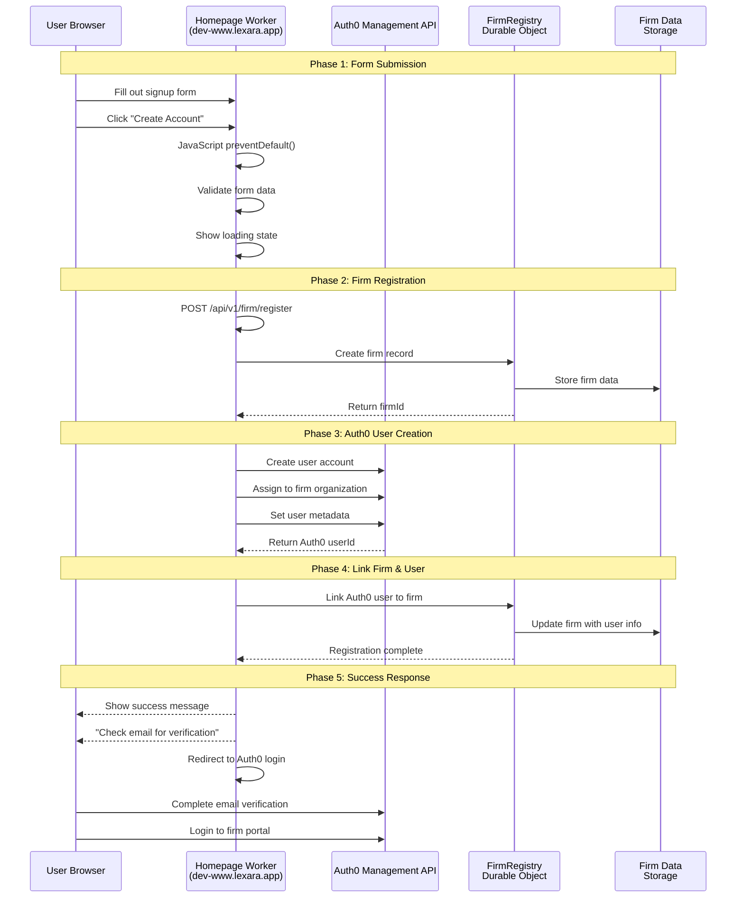

# Firm Signup Flow Analysis & Design

## 🚨 **Current Issues Identified**

### **Problem 1: Wrong API Endpoint**
- JavaScript calls `https://lexara-api-demo.cloudswift.workers.dev/api/v1/firm/register`
- This is a DEMO endpoint that returns mock success responses
- It does NOT create Auth0 users or interact with real Durable Objects

### **Problem 2: Missing Backend Implementation**
- No actual `/api/v1/firm/register` endpoint in the homepage worker
- No Auth0 user creation logic
- No Durable Objects integration for firm storage

### **Problem 3: Incomplete Auth0 Integration**
- No Auth0 Management API calls for user creation
- No organization assignment in Auth0
- No proper authentication flow post-registration

## 🎯 **Complete Signup Flow Design**

### **Mermaid Sequence Diagram**



## 🔧 **Required Components**

### **1. Homepage Worker Registration Endpoint**
**File**: `apps/homepage/src/pages/api/v1/firm/register.ts`

```typescript
export async function POST(request: Request): Promise<Response> {
  try {
    const firmData = await request.json();
    
    // 1. Create firm in Durable Objects
    const firmId = await createFirm(firmData);
    
    // 2. Create Auth0 user
    const auth0User = await createAuth0User(firmData);
    
    // 3. Link user to firm
    await linkUserToFirm(firmId, auth0User.user_id);
    
    return new Response(JSON.stringify({
      success: true,
      firmId,
      auth0UserId: auth0User.user_id,
      message: `Welcome ${firmData.firstName}! Check your email to verify your account.`
    }));
  } catch (error) {
    return new Response(JSON.stringify({
      success: false,
      error: error.message
    }), { status: 400 });
  }
}
```

### **2. Auth0 Management API Integration**
**File**: `apps/homepage/src/utils/auth0-management.ts`

```typescript
class Auth0Management {
  async createUser(userData: UserData): Promise<Auth0User> {
    const response = await fetch(`https://${AUTH0_DOMAIN}/api/v2/users`, {
      method: 'POST',
      headers: {
        'Authorization': `Bearer ${await this.getManagementToken()}`,
        'Content-Type': 'application/json'
      },
      body: JSON.stringify({
        email: userData.email,
        password: generateSecurePassword(),
        name: `${userData.firstName} ${userData.lastName}`,
        user_metadata: {
          firmId: userData.firmId,
          role: 'admin'
        },
        app_metadata: {
          organization: userData.firmId,
          permissions: ['firm:admin']
        }
      })
    });
    
    return response.json();
  }
}
```

### **3. FirmRegistry Durable Object**
**File**: `apps/homepage/src/durable-objects/firm-registry.ts`

```typescript
export class FirmRegistry {
  async createFirm(firmData: FirmRegistrationData): Promise<string> {
    const firmId = generateULID();
    
    const firm: FirmRecord = {
      firmId,
      name: firmData.firmName,
      size: firmData.firmSize,
      practiceAreas: firmData.practiceAreas,
      plan: firmData.plan,
      status: 'pending_verification',
      createdAt: new Date().toISOString(),
      adminUsers: [],
      settings: {
        intakeEnabled: true,
        conflictDetectionEnabled: true,
        autoAssignmentEnabled: false
      }
    };
    
    await this.state.storage.put(`firm:${firmId}`, firm);
    return firmId;
  }
  
  async linkUserToFirm(firmId: string, auth0UserId: string): Promise<void> {
    const firm = await this.state.storage.get(`firm:${firmId}`);
    firm.adminUsers.push({
      auth0UserId,
      role: 'admin',
      addedAt: new Date().toISOString()
    });
    await this.state.storage.put(`firm:${firmId}`, firm);
  }
}
```

## 🧪 **Comprehensive Test Harness**

### **End-to-End Test Script**
**File**: `tests/firm-signup-e2e.test.ts`

```typescript
describe('Firm Signup End-to-End', () => {
  test('Complete firm registration flow', async () => {
    // 1. Submit form data
    const firmData = {
      plan: 'professional',
      firmName: 'Test Law Firm',
      firmSize: '1',
      practiceAreas: ['personal_injury'],
      firstName: 'John',
      lastName: 'Doe',
      email: 'john@testfirm.com',
      agreedToTerms: true
    };
    
    // 2. Call registration endpoint
    const response = await fetch('/api/v1/firm/register', {
      method: 'POST',
      headers: { 'Content-Type': 'application/json' },
      body: JSON.stringify(firmData)
    });
    
    const result = await response.json();
    expect(result.success).toBe(true);
    expect(result.firmId).toBeTruthy();
    expect(result.auth0UserId).toBeTruthy();
    
    // 3. Verify firm created in Durable Objects
    const firmCheck = await checkFirmExists(result.firmId);
    expect(firmCheck.exists).toBe(true);
    expect(firmCheck.data.name).toBe('Test Law Firm');
    
    // 4. Verify user created in Auth0
    const auth0Check = await checkAuth0User(result.auth0UserId);
    expect(auth0Check.exists).toBe(true);
    expect(auth0Check.email).toBe('john@testfirm.com');
    
    // 5. Verify user linked to firm
    const linkCheck = await checkUserFirmLink(result.firmId, result.auth0UserId);
    expect(linkCheck.linked).toBe(true);
  });
});
```

## 🚀 **Implementation Plan**

### **Phase 1: Backend Implementation** (Current Priority)
1. ✅ Create `/api/v1/firm/register` endpoint in homepage worker
2. ✅ Implement Auth0 Management API integration
3. ✅ Create FirmRegistry Durable Object
4. ✅ Add proper error handling and validation

### **Phase 2: Frontend Integration**
1. ✅ Update JavaScript to call correct endpoint
2. ✅ Add proper error handling in UI
3. ✅ Implement success flow with Auth0 redirect
4. ✅ Add email verification messaging

### **Phase 3: Testing & Validation**
1. ✅ Build comprehensive test harness
2. ✅ Test Auth0 user creation
3. ✅ Test Durable Objects integration
4. ✅ Test complete end-to-end flow

## 🔍 **Current State Analysis**

### **What's Working:**
- ✅ Form HTML structure with proper POST handling
- ✅ JavaScript form validation and data collection
- ✅ Basic API client structure

### **What's Broken:**
- ❌ JavaScript calls wrong API endpoint (demo only)
- ❌ No actual registration backend implementation
- ❌ No Auth0 user creation
- ❌ No Durable Objects integration
- ❌ No success flow or redirects

### **Next Steps:**
1. Implement actual registration endpoint
2. Add Auth0 Management API integration  
3. Create FirmRegistry Durable Object
4. Update frontend to call correct endpoint
5. Build comprehensive tests

This analysis shows we need to build the actual backend infrastructure that the frontend is trying to call.