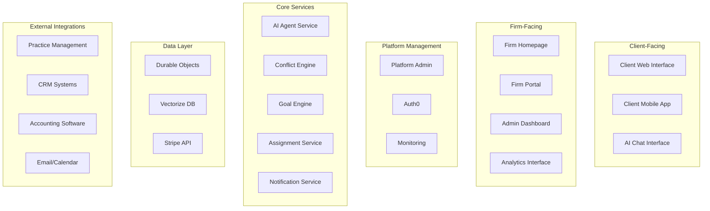
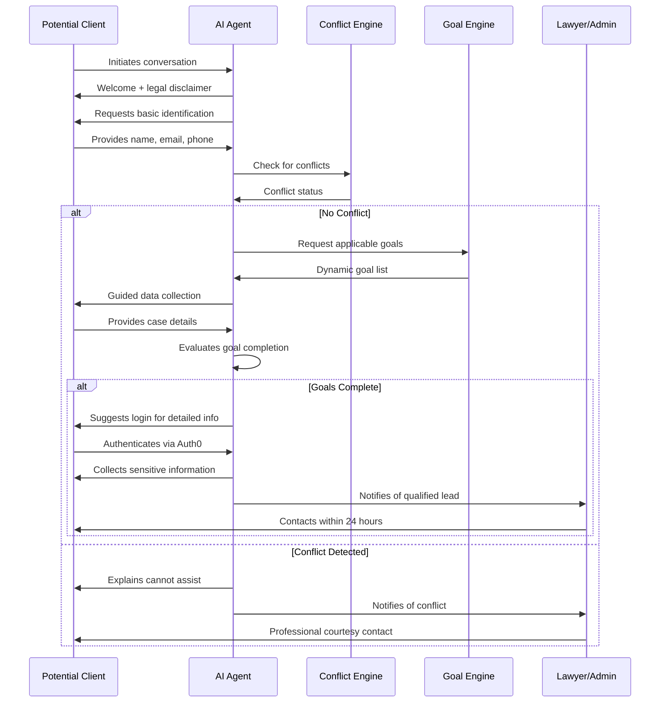
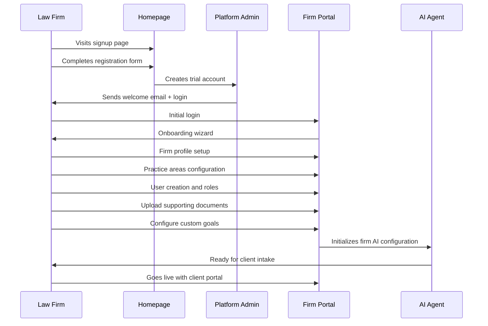
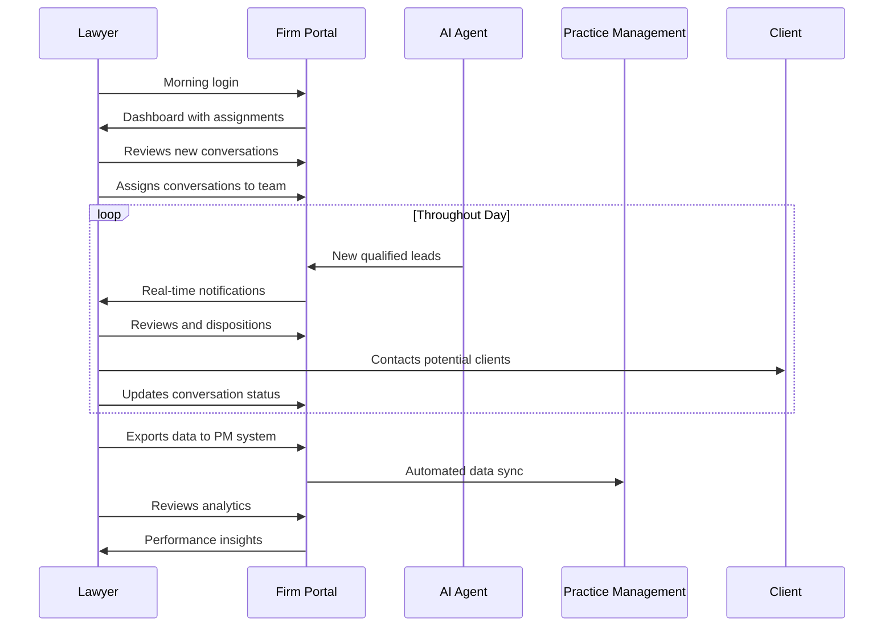

# Functional Design Document - Lexara Engage Platform

## Document Overview

This document outlines the complete functional design for the Lexara Engage platform, detailing how law firm data, user roles, permissions, and AI-powered client intake workflows integrate to create a comprehensive legal technology solution.

**Document Version**: 1.0  
**Last Updated**: December 2024  
**Scope**: Complete platform functionality and user experience design

---

## Table of Contents

1. [System Architecture Overview](#system-architecture-overview)
2. [User Experience Flows](#user-experience-flows)
3. [Core Functional Modules](#core-functional-modules)
4. [Data Flow and Integration](#data-flow-and-integration)
5. [Security and Compliance Framework](#security-and-compliance-framework)
6. [API Design and Integration Points](#api-design-and-integration-points)
7. [User Interface Specifications](#user-interface-specifications)
8. [Business Logic and Rules Engine](#business-logic-and-rules-engine)
9. [Performance and Scalability](#performance-and-scalability)
10. [Implementation Roadmap](#implementation-roadmap)

---

## System Architecture Overview

### Platform Components



### Multi-Tenant Architecture

**Tenant Isolation Strategy**:
- **Data Isolation**: Complete separation at the Durable Object level using `firmId` prefixes
- **Configuration Isolation**: Firm-specific settings, branding, and business rules
- **User Isolation**: Auth0 organizations for authentication boundary enforcement
- **Resource Isolation**: Per-firm usage tracking and billing boundaries

### Technology Stack

**Frontend Technologies**:
- **Astro SSR**: Server-side rendering for optimal performance and SEO
- **TypeScript**: Type-safe development across all components
- **Tailwind CSS**: Utility-first styling with design system consistency
- **Web Components**: Reusable UI components across applications

**Backend Technologies**:
- **Cloudflare Workers**: Edge computing for global performance
- **Durable Objects**: Primary data layer with strong consistency for real-time legal work
- **D1 SQLite**: Query and analytics layer with eventually consistent indexes for datagrids
- **Vectorize**: AI-powered search and semantic matching for knowledge bases
- **Workers AI**: Claude integration with fallback to Cloudflare models

**Integration Technologies**:
- **MCP (Model Context Protocol)**: Standardized AI agent communication
- **OAuth2/OpenID Connect**: Secure authentication and authorization
- **Webhooks**: Real-time data synchronization
- **REST APIs**: Standard HTTP APIs for external integrations

---

## User Experience Flows

### Client Journey - Potential Client Intake



### Law Firm Onboarding Flow



### Daily Operations Flow - Lawyer Workflow



---

## Core Functional Modules

### 1. AI Agent Engine

**Purpose**: Intelligent conversation management with dynamic goal-driven data collection.

**Key Features**:
- **Natural Language Processing**: Claude-powered conversation understanding
- **Dynamic Goal Generation**: Context-aware data collection requirements
- **Conflict Detection Integration**: Real-time conflict checking during conversation
- **Multi-Phase Security**: Pre-login and post-authentication conversation phases
- **Resumable Sessions**: Persistent conversation state with secure tokens

**Technical Implementation**:
```typescript
interface AIAgentEngine {
  // Core conversation management
  initializeConversation(firmId: string, clientContext?: ClientContext): ConversationSession;
  processMessage(sessionId: string, message: string, context: MessageContext): AIResponse;
  evaluateGoals(sessionId: string): GoalEvaluationResult;
  
  // Dynamic behavior adaptation
  loadFirmConfiguration(firmId: string): FirmAIConfig;
  adaptConversationFlow(sessionData: ConversationState): ConversationStrategy;
  generateCustomQuestions(goals: Goal[], context: ConversationContext): Question[];
  
  // Integration points
  checkConflicts(identityData: IdentityData): ConflictResult;
  searchSupportingDocuments(query: string, context: SearchContext): Document[];
  triggerAssignment(conversation: ConversationSession): AssignmentResult;
}
```

### 2. Firm Management System

**Purpose**: Comprehensive law firm configuration and operational management.

**Key Features**:
- **Multi-Tenant Firm Profiles**: Complete firm identity and business information
- **Practice Area Configuration**: Customizable practice areas with matter type definitions
- **Geographic Scope Management**: Jurisdiction and service area configuration
- **User and Role Management**: Comprehensive RBAC with custom role creation
- **Brand Customization**: White-label capabilities with custom branding

**User Interface Components**:
- **Firm Dashboard**: Overview of firm performance and key metrics
- **Settings Management**: Multi-tab configuration interface
- **User Management**: User lifecycle, roles, and permissions interface
- **Brand Builder**: Visual brand customization tools
- **Geographic Mapper**: Interactive jurisdiction and service area selection

### 3. Conversation Management Hub

**Purpose**: Centralized management of all client interactions and lead processing.

**Key Features**:
- **Conversation Listing**: Filterable, sortable list of all firm conversations
- **Assignment Management**: Automated and manual conversation routing
- **Review Workflows**: Structured conversation review and disposition process
- **Performance Analytics**: Individual and team performance metrics
- **Export Capabilities**: Data export to practice management systems

**Workflow States**:
```typescript
type ConversationWorkflowState = 
  | 'active'              // Currently in progress with client
  | 'completed'           // Client finished providing information
  | 'under_review'        // Assigned for lawyer review
  | 'contacted'           // Lawyer has contacted the client
  | 'converted'           // Client became a paying client
  | 'declined'            // Firm declined representation
  | 'referred'            // Referred to another firm
  | 'conflict'            // Conflict of interest detected
  | 'abandoned'           // Client stopped responding
  | 'archived';           // Moved to archive for retention
```

### 4. Conflict Management Engine

**Purpose**: Comprehensive conflict of interest detection and management system.

**Key Features**:
- **Multi-Field Matching**: Name, email, phone, address, business name comparison
- **Fuzzy Logic Matching**: Handles variations, nicknames, and partial matches
- **Relationship Mapping**: Complex relationship and entity connection detection
- **Resolution Workflows**: Structured conflict resolution and waiver processes
- **Audit Trails**: Complete conflict check history and decision tracking

**Conflict Detection Algorithm**:
```typescript
interface ConflictDetectionEngine {
  // Core detection methods
  checkPrimaryConflicts(identity: ClientIdentity): DirectConflictResult[];
  checkRelationalConflicts(identity: ClientIdentity, relationships: Relationship[]): RelationalConflictResult[];
  checkPositionalConflicts(matterType: string, parties: Party[]): PositionalConflictResult[];
  
  // Advanced matching
  fuzzyNameMatch(inputName: string, threshold: number): NameMatchResult[];
  businessEntityMatch(businessInfo: BusinessInfo): EntityMatchResult[];
  geographicConflictCheck(jurisdiction: string, matterType: string): GeographicConflictResult[];
  
  // Resolution management
  requestConflictWaiver(conflictId: string, justification: string): WaiverRequest;
  resolveConflict(conflictId: string, resolution: ConflictResolution): void;
  generateConflictReport(timeRange: DateRange): ConflictReport;
}
```

### 5. Knowledge Management System

**Purpose**: AI-powered knowledge base for supporting documentation and custom goals.

**Key Features**:
- **Document Processing**: Automated parsing and vectorization of uploaded documents
- **Semantic Search**: AI-powered search across all firm knowledge
- **Goal Extraction**: Automatic identification of data collection requirements from documents
- **Version Control**: Document versioning with change tracking
- **Usage Analytics**: Tracking of document effectiveness and usage patterns

**Document Processing Pipeline**:
```typescript
interface DocumentProcessor {
  // Document ingestion
  processUpload(file: File, metadata: DocumentMetadata): ProcessingResult;
  extractText(file: File): string;
  generateEmbeddings(text: string): number[];
  
  // Content analysis
  extractGoals(content: string): Goal[];
  identifyKeywords(content: string): string[];
  categorizeDocument(content: string): DocumentCategory;
  
  // Search and retrieval
  semanticSearch(query: string, filters: SearchFilters): SearchResult[];
  findRelevantDocuments(conversationContext: ConversationContext): Document[];
  getSimilarDocuments(documentId: string): Document[];
}
```

### 6. Assignment and Routing Engine

**Purpose**: Intelligent conversation assignment and workload distribution system.

**Key Features**:
- **Rule-Based Assignment**: Configurable rules based on practice areas, experience, capacity
- **Load Balancing**: Automatic workload distribution across team members
- **Escalation Management**: Time-based escalation for unresponded assignments
- **Availability Integration**: Integration with calendar and schedule systems
- **Performance Optimization**: Assignment optimization based on historical success rates

**Assignment Algorithm**:
```typescript
interface AssignmentEngine {
  // Core assignment logic
  assignConversation(conversation: ConversationSession): AssignmentResult;
  evaluateAssignmentRules(conversation: ConversationSession): RuleEvaluationResult[];
  calculateUserCapacity(userId: string): CapacityAssessment;
  
  // Load balancing
  distributeWorkload(conversations: ConversationSession[], team: User[]): AssignmentPlan;
  rebalanceAssignments(teamId: string): RebalancingResult;
  
  // Escalation management
  checkEscalationRequired(assignmentId: string): EscalationCheck;
  escalateAssignment(assignmentId: string, escalationLevel: number): EscalationResult;
  
  // Performance optimization
  analyzeAssignmentEffectiveness(userId: string, timeRange: DateRange): EffectivenessAnalysis;
  optimizeAssignmentRules(performanceData: PerformanceData[]): RuleOptimization[];
}
```

### 7. Analytics and Reporting Engine

**Purpose**: Comprehensive business intelligence and performance analytics system.

**Key Features**:
- **Real-Time Dashboards**: Live metrics and KPI tracking
- **Custom Report Builder**: Flexible report creation with multiple data sources
- **Automated Reporting**: Scheduled report generation and delivery
- **Predictive Analytics**: AI-powered insights and trend analysis
- **Performance Benchmarking**: Industry and historical performance comparisons

**Analytics Data Model**:
```typescript
interface AnalyticsEngine {
  // Dashboard management
  generateDashboard(userId: string, dateRange: DateRange): Dashboard;
  getKPIMetrics(firmId: string, metrics: KPIType[]): KPIData[];
  calculateTrends(metric: string, timeRange: DateRange): TrendAnalysis;
  
  // Report generation
  buildCustomReport(reportConfig: ReportConfiguration): Report;
  scheduleReport(reportConfig: ReportConfiguration, schedule: Schedule): ScheduledReport;
  exportReport(reportId: string, format: ExportFormat): ExportResult;
  
  // Predictive analytics
  forecastConversationVolume(firmId: string, horizon: number): VolumeForcast;
  predictConversionLikelihood(conversation: ConversationSession): ConversionPrediction;
  identifyPerformanceAnomalies(firmId: string): Anomaly[];
  
  // Benchmarking
  generateBenchmarkReport(firmId: string, comparisonSet: string): BenchmarkReport;
  calculateIndustryPercentiles(metrics: Metric[]): PercentileRanking[];
}
```

### 8. Integration Management System

**Purpose**: Seamless connectivity with practice management and external systems.

**Key Features**:
- **OAuth2 Authentication**: Secure connection to external systems
- **Field Mapping**: Flexible data transformation between systems
- **Real-Time Synchronization**: Webhook-based data sync
- **Error Handling**: Robust retry logic and error reporting
- **Custom Integrations**: API framework for custom connections

**Integration Framework**:
```typescript
interface IntegrationManager {
  // Connection management
  establishConnection(systemType: IntegrationSystem, credentials: ConnectionCredentials): ConnectionResult;
  testConnection(connectionId: string): ConnectionTest;
  refreshAuthentication(connectionId: string): AuthRefreshResult;
  
  // Data synchronization
  syncData(connectionId: string, syncConfig: SyncConfiguration): SyncResult;
  mapFields(sourceData: any, fieldMapping: FieldMapping): any;
  handleWebhook(webhook: WebhookPayload): WebhookResult;
  
  // Error management
  retryFailedSync(syncId: string): RetryResult;
  generateErrorReport(connectionId: string, timeRange: DateRange): ErrorReport;
  
  // Custom integrations
  createCustomIntegration(config: CustomIntegrationConfig): CustomIntegration;
  executeCustomSync(integrationId: string, data: any): CustomSyncResult;
}
```

---

## Data Flow and Integration

### Hybrid Data Architecture

**Primary Data Layer (Durable Objects)**:
```
Real-time Legal Conversations → ConversationSession DO → Strong Consistency → Immediate Conflict Detection
User Authentication & Identity → UserIdentity DO → Auth0 Integration → Cross-Session Continuity  
```

**Query & Analytics Layer (D1)**:
```
Conversation Updates → Index Sync → D1 Tables → SQL Queries → Datagrid Views
Audit Events → Async Logging → D1 Indexes → Compliance Reports → Legal Analytics
```

**Knowledge & Vector Layer (Vectorize)**:
```
Firm Knowledge Base → Document Embeddings → Vectorize → Semantic Search → AI Context Enhancement
Conflict Database → Entity Vectors → Vectorize → Fuzzy Matching → Conflict Detection
```

### Data Flow Patterns

**1. Write Flow (Primary → Index)**:
```typescript
// Real-time updates to primary data layer
ConversationSession.addMessage() → 
  Update DO State (immediate) → 
  Trigger D1 Index Sync (async) → 
  Update conversation_index (eventually consistent)
```

**2. Read Flow (Index → Primary)**:
```typescript
// Fast queries for lists, detailed reads from primary
getFirmConversations() → 
  Query D1 conversation_index (sub-second) → 
  Return conversation list
  
getConversationDetails(sessionId) → 
  Query ConversationSession DO (millisecond) → 
  Return full conversation state
```

**3. Analytics Flow (Index → Reports)**:
```typescript
// Cross-conversation analytics from D1
generateFirmAnalytics() → 
  JOIN conversation_index + user_index + audit_log_index → 
  SQL aggregations → 
  Business intelligence dashboards
```

### Primary Data Flows

**1. Client Intake Data Flow**:
```
Client Input → AI Agent → ConversationSession DO → Goal Engine → Conflict Engine → D1 Index Update → Assignment Engine → Lawyer Notification → Practice Management System
```

**2. Firm Configuration Data Flow**:
```
Admin Input → Firm Profile → D1 Configuration Tables → AI Configuration → Vectorize Knowledge Base → Goal Templates → Live AI Behavior
```

**3. Analytics Data Flow**:
```
User Actions → ConversationSession DO → D1 Index Sync → Data Aggregation → Analytics Engine → Dashboard/Reports → Business Insights
```

### Data Synchronization Patterns

**Real-Time Sync**:
- Conversation assignments and notifications
- Conflict detection alerts
- System health monitoring
- User authentication events

**Batch Sync**:
- Analytics data aggregation
- Practice management system exports
- Billing and usage calculations
- Audit log consolidation

**Event-Driven Sync**:
- Goal completion triggers
- Assignment escalations
- Integration webhooks
- Compliance notifications

### Data Validation and Quality

**Input Validation**:
- Client-provided data sanitization
- Firm configuration validation
- User permission verification
- Integration data validation

**Data Quality Monitoring**:
- Conversation completion rates
- Data field completeness
- Conflict detection accuracy
- Integration sync success rates

---

## Security and Compliance Framework

### Multi-Layered Security Architecture

**1. Infrastructure Security**:
- **Cloudflare Edge Protection**: DDoS protection, WAF, rate limiting
- **TLS 1.3 Encryption**: End-to-end encryption for all communications
- **Zero Trust Network**: No inherent trust, verify everything
- **Geographic Data Residency**: Data stored in appropriate legal jurisdictions

**2. Application Security**:
- **OAuth2/OpenID Connect**: Industry-standard authentication
- **JWT Token Management**: Secure, short-lived access tokens
- **RBAC Implementation**: Granular role-based access control
- **Input Sanitization**: Protection against injection attacks

**3. Data Security**:
- **Encryption at Rest**: All stored data encrypted with AES-256
- **Field-Level Encryption**: Sensitive PII encrypted at field level
- **Key Management**: Automated key rotation and secure key storage
- **Data Minimization**: Collect only necessary data, purge per retention policies

### Compliance Framework

**Legal Industry Compliance**:
- **Attorney-Client Privilege**: Proper handling of privileged communications
- **Professional Responsibility Rules**: Compliance with state bar requirements
- **Conflict of Interest Rules**: Automated conflict detection and management
- **Client Confidentiality**: Strict access controls and audit trails

**Data Protection Compliance**:
- **GDPR Compliance**: EU data protection regulation compliance
- **CCPA Compliance**: California Consumer Privacy Act compliance
- **PIPEDA Compliance**: Canadian privacy law compliance
- **HIPAA Considerations**: Healthcare data protection where applicable

**Technical Compliance**:
- **SOC 2 Type II**: Security, availability, and confidentiality controls
- **ISO 27001**: Information security management system
- **PCI DSS**: Payment card industry data security standards
- **FedRAMP**: Federal risk and authorization management program readiness

### Audit and Monitoring

**Comprehensive Audit Logging**:
- **User Actions**: All user interactions logged with context
- **Data Access**: Complete audit trail of data access and modifications
- **System Events**: Technical events and system changes logged
- **Integration Activities**: External system interactions tracked

**Real-Time Monitoring**:
- **Security Event Monitoring**: Real-time detection of suspicious activities
- **Performance Monitoring**: System performance and availability tracking
- **Compliance Monitoring**: Automated compliance rule verification
- **Error Tracking**: Comprehensive error logging and alerting

---

## API Design and Integration Points

### RESTful API Architecture

**Base URL Structure**:
```
https://api.lexara.app/v1/{resource}
```

**Core API Endpoints**:

```typescript
// Conversation Management
POST   /v1/conversations                    // Create new conversation
GET    /v1/conversations/{id}               // Get conversation details
PUT    /v1/conversations/{id}               // Update conversation
DELETE /v1/conversations/{id}               // Delete conversation
POST   /v1/conversations/{id}/messages      // Add message to conversation
GET    /v1/conversations/{id}/resume/{token} // Resume conversation

// Firm Management
GET    /v1/firms/{firmId}                   // Get firm details
PUT    /v1/firms/{firmId}                   // Update firm profile
GET    /v1/firms/{firmId}/users             // List firm users
POST   /v1/firms/{firmId}/users             // Create new user
PUT    /v1/firms/{firmId}/users/{userId}    // Update user
DELETE /v1/firms/{firmId}/users/{userId}    // Deactivate user

// Configuration Management
GET    /v1/firms/{firmId}/practice-areas    // Get practice area config
PUT    /v1/firms/{firmId}/practice-areas    // Update practice areas
GET    /v1/firms/{firmId}/goals             // Get custom goals
POST   /v1/firms/{firmId}/goals             // Create custom goal
PUT    /v1/firms/{firmId}/goals/{goalId}    // Update goal
DELETE /v1/firms/{firmId}/goals/{goalId}    // Delete goal

// Document Management
GET    /v1/firms/{firmId}/documents         // List documents
POST   /v1/firms/{firmId}/documents         // Upload document
GET    /v1/firms/{firmId}/documents/{docId} // Get document
PUT    /v1/firms/{firmId}/documents/{docId} // Update document
DELETE /v1/firms/{firmId}/documents/{docId} // Delete document

// Analytics and Reporting
GET    /v1/firms/{firmId}/analytics         // Get analytics data
POST   /v1/firms/{firmId}/reports           // Generate custom report
GET    /v1/firms/{firmId}/reports/{reportId} // Get report
POST   /v1/firms/{firmId}/exports           // Export firm data

// Integration Management
GET    /v1/firms/{firmId}/integrations      // List integrations
POST   /v1/firms/{firmId}/integrations      // Create integration
PUT    /v1/firms/{firmId}/integrations/{id} // Update integration
DELETE /v1/firms/{firmId}/integrations/{id} // Remove integration
POST   /v1/integrations/{id}/sync           // Trigger manual sync
```

### Webhook System

**Webhook Event Types**:
```typescript
type WebhookEventType = 
  | 'conversation.created'      // New conversation started
  | 'conversation.completed'    // All goals completed
  | 'conversation.assigned'     // Conversation assigned to user
  | 'conversation.escalated'    // Assignment escalated
  | 'conflict.detected'         // Conflict of interest found
  | 'goal.completed'           // Individual goal completed
  | 'document.uploaded'        // New document added
  | 'user.created'             // New user added to firm
  | 'integration.sync.completed' // Data sync completed
  | 'integration.sync.failed'   // Data sync failed
  | 'billing.invoice.created'   // New invoice generated
  | 'system.maintenance'        // Scheduled maintenance notice;
```

**Webhook Payload Structure**:
```typescript
interface WebhookPayload {
  id: string;                   // Unique webhook delivery ID
  event: WebhookEventType;      // Event type
  timestamp: Date;              // Event timestamp
  firmId: string;               // Firm identifier
  data: any;                    // Event-specific data
  signature: string;            // HMAC signature for verification
  retryCount: number;           // Number of delivery attempts
}
```

### External Integration Standards

**Practice Management System Integrations**:
- **Clio**: RESTful API with OAuth2 authentication
- **MyCase**: API key authentication with webhook support
- **PracticePanther**: OAuth2 with field mapping capabilities
- **Smokeball**: Custom integration with document sync
- **Filevine**: Advanced API with project management integration

**CRM System Integrations**:
- **Salesforce**: Comprehensive API with custom objects
- **HubSpot**: Contact and deal synchronization
- **Pipedrive**: Lead management and sales pipeline integration
- **Zoho CRM**: Multi-module integration capabilities

**Accounting System Integrations**:
- **QuickBooks**: Invoice and payment synchronization
- **Xero**: Automated billing and expense tracking
- **FreshBooks**: Time tracking and project billing
- **Sage**: Enterprise accounting integration

---

## User Interface Specifications

### Design System

**Visual Design Principles**:
- **Professional Aesthetics**: Clean, trustworthy design appropriate for legal industry
- **Accessibility First**: WCAG 2.1 AA compliance for all interfaces
- **Responsive Design**: Mobile-first approach with desktop optimization
- **Brand Consistency**: Cohesive visual language across all touchpoints

**Component Library**:
```typescript
// Core UI Components
interface DesignSystem {
  // Layout Components
  Layout: React.ComponentType<LayoutProps>;
  Container: React.ComponentType<ContainerProps>;
  Grid: React.ComponentType<GridProps>;
  
  // Navigation Components
  Header: React.ComponentType<HeaderProps>;
  Sidebar: React.ComponentType<SidebarProps>;
  Breadcrumb: React.ComponentType<BreadcrumbProps>;
  
  // Data Display Components
  Table: React.ComponentType<TableProps>;
  Card: React.ComponentType<CardProps>;
  List: React.ComponentType<ListProps>;
  
  // Input Components
  Form: React.ComponentType<FormProps>;
  Input: React.ComponentType<InputProps>;
  Select: React.ComponentType<SelectProps>;
  DatePicker: React.ComponentType<DatePickerProps>;
  
  // Feedback Components
  Alert: React.ComponentType<AlertProps>;
  Modal: React.ComponentType<ModalProps>;
  Toast: React.ComponentType<ToastProps>;
  
  // Specialized Components
  ConversationViewer: React.ComponentType<ConversationViewerProps>;
  AnalyticsDashboard: React.ComponentType<DashboardProps>;
  DocumentUploader: React.ComponentType<UploaderProps>;
}
```

### Client-Facing Interfaces

**1. AI Chat Interface**:
- **Conversation Window**: Full-screen chat with typing indicators
- **Legal Disclaimers**: Prominent display of important legal notices
- **Progress Indicators**: Visual progress through data collection goals
- **Resume Capability**: Easy conversation resumption with secure links
- **Mobile Optimization**: Touch-friendly interface for mobile devices

**2. Client Portal** (Future Enhancement):
- **Case Status**: Real-time updates on case progress
- **Document Sharing**: Secure document upload and sharing
- **Communication Hub**: Centralized communication with legal team
- **Billing Transparency**: Clear billing information and payment options

### Firm-Facing Interfaces

**1. Firm Dashboard**:
- **Key Metrics**: Conversation volume, conversion rates, response times
- **Active Conversations**: Real-time list of ongoing client interactions
- **Assignment Queue**: Pending assignments and escalations
- **Performance Indicators**: Team and individual performance metrics
- **Quick Actions**: Common tasks accessible from dashboard

**2. Conversation Management Interface**:
- **Conversation List**: Filterable, sortable list with bulk actions
- **Conversation Detail**: Complete conversation transcript with metadata
- **Assignment Controls**: User assignment and reassignment capabilities
- **Review Workflow**: Structured review and disposition process
- **Export Options**: Multiple export formats for external systems

**3. Firm Configuration Interface**:
- **Multi-Tab Settings**: Organized configuration across functional areas
- **Practice Area Builder**: Visual practice area and matter type configuration
- **User Management**: Complete user lifecycle management
- **Goal Builder**: Custom goal creation with trigger configuration
- **Brand Customization**: Visual brand builder with real-time preview

**4. Analytics and Reporting Interface**:
- **Interactive Dashboards**: Drill-down capabilities with real-time data
- **Custom Report Builder**: Drag-and-drop report construction
- **Export Center**: Scheduled and on-demand report generation
- **Performance Comparisons**: Benchmarking against industry standards

### Platform Administration Interfaces

**1. Platform Admin Dashboard**:
- **System Health**: Real-time system performance and availability
- **Firm Management**: Customer lifecycle and account management
- **Usage Analytics**: Platform-wide usage patterns and trends
- **Support Tools**: Customer support and troubleshooting utilities

**2. Audit and Compliance Interface**:
- **Audit Log Viewer**: Searchable, filterable audit trail
- **Compliance Dashboard**: Regulatory compliance status and reporting
- **Security Monitoring**: Real-time security event monitoring
- **Data Management**: Data retention and privacy compliance tools

---

## Business Logic and Rules Engine

### Core Business Rules

**Conversation Flow Rules**:
```typescript
interface ConversationRules {
  // Pre-login phase rules
  requireBasicIdentification: boolean;        // Must collect name, email, phone
  conflictCheckRequired: boolean;             // Must check conflicts before proceeding
  legalNeedsAssessmentRequired: boolean;      // Must understand legal matter type
  
  // Authentication rules
  suggestLoginAfterGoals: number;            // Suggest login after N goals completed
  requireLoginForSensitive: boolean;         // Require auth for sensitive information
  maxPreLoginMessages: number;               // Limit conversation length pre-auth
  
  // Data collection rules
  practiceAreaSpecificGoals: boolean;        // Load goals based on practice area
  minimumGoalsForCompletion: number;         // Minimum goals before completion
  dynamicGoalLoading: boolean;               // Load additional goals based on context
  
  // Assignment rules
  autoAssignOnCompletion: boolean;           // Automatically assign completed conversations
  respectUserCapacity: boolean;              // Consider user workload in assignment
  escalateUnassigned: number;                // Escalate after N minutes if unassigned
}
```

**Conflict Detection Rules**:
```typescript
interface ConflictRules {
  // Matching thresholds
  exactMatchThreshold: number;               // 100% for exact matches
  fuzzyMatchThreshold: number;               // 85% for fuzzy matches
  nameVariationThreshold: number;            // 90% for name variations
  
  // Matching scope
  checkNames: boolean;                       // Check person names
  checkBusinessNames: boolean;               // Check business/organization names
  checkEmails: boolean;                      // Check email addresses
  checkPhones: boolean;                      // Check phone numbers
  checkAddresses: boolean;                   // Check physical addresses
  
  // Conflict resolution
  allowManualOverride: boolean;              // Permit manual conflict override
  requireJustification: boolean;             // Require justification for overrides
  escalateConflicts: boolean;                // Escalate conflicts to senior users
  
  // Relationship checking
  checkRelatedParties: boolean;              // Check for related party conflicts
  checkAdverseParties: boolean;              // Check for adverse party conflicts
  checkBusinessRelationships: boolean;       // Check for business relationship conflicts
}
```

**Assignment Rules Engine**:
```typescript
interface AssignmentRules {
  // Primary assignment criteria
  practiceAreaMatching: boolean;             // Match by practice area expertise
  geographicMatching: boolean;               // Match by geographic scope
  experienceMatching: boolean;               // Match by experience level
  languageMatching: boolean;                 // Match by language capabilities
  
  // Capacity management
  respectMaxCaseload: boolean;               // Honor maximum caseload limits
  considerCurrentWorkload: boolean;          // Factor in current assignments
  balanceTeamWorkload: boolean;              // Distribute evenly across team
  
  // Time-based rules
  respectBusinessHours: boolean;             // Consider user availability
  rotateAssignments: boolean;                // Use round-robin assignment
  prioritizeUrgent: boolean;                 // Fast-track urgent matters
  
  // Escalation rules
  escalateAfterMinutes: number;              // Escalate if no response
  escalationChain: string[];                 // User IDs for escalation
  weekendEscalation: boolean;                // Different rules for weekends
}
```

### Dynamic Goal Generation

**Goal Priority System**:
```typescript
enum GoalPriority {
  CRITICAL = 1,      // Must complete before proceeding
  REQUIRED = 2,      // Required for case evaluation
  IMPORTANT = 3,     // Highly valuable information
  OPTIONAL = 4       // Nice to have information
}

interface GoalGenerationEngine {
  // Base goal loading
  loadBaseGoals(practiceArea: LegalPracticeArea): Goal[];
  loadMatterTypeGoals(matterType: string): Goal[];
  
  // Dynamic goal generation
  generateContextualGoals(conversationState: ConversationState): Goal[];
  generateConflictRelatedGoals(conflictInfo: ConflictInfo): Goal[];
  generateDocumentBasedGoals(relevantDocs: Document[]): Goal[];
  
  // Goal prioritization
  prioritizeGoals(goals: Goal[], context: ConversationContext): Goal[];
  filterGoalsByJurisdiction(goals: Goal[], jurisdiction: string): Goal[];
  adaptGoalsForClientType(goals: Goal[], clientType: ClientType): Goal[];
}
```

### Workflow Automation

**Automated Workflows**:
```typescript
interface WorkflowEngine {
  // Conversation workflows
  autoAssignOnGoalCompletion(conversation: ConversationSession): void;
  sendClientFollowupEmail(conversationId: string, delayHours: number): void;
  escalateStaleAssignments(maxHours: number): void;
  
  // Data management workflows
  archiveOldConversations(retentionDays: number): void;
  exportToIntegratedSystems(conversation: ConversationSession): void;
  generatePerformanceReports(schedule: Schedule): void;
  
  // Compliance workflows
  auditDataAccess(suspiciousActivity: SecurityEvent): void;
  enforceRetentionPolicies(firmId: string): void;
  generateComplianceReports(regulationType: RegulationType): void;
  
  // Business workflows
  invoiceGeneration(billingCycle: BillingCycle): void;
  usageMonitoring(firmId: string): void;
  performanceOptimization(analysisType: AnalysisType): void;
}
```

---

## Performance and Scalability

### Performance Targets

**Response Time Requirements**:
- **AI Chat Responses**: < 3 seconds for 95% of interactions
- **Dashboard Loading**: < 2 seconds for initial load
- **Search Operations**: < 1 second for standard searches
- **Report Generation**: < 30 seconds for standard reports
- **Data Export**: < 5 minutes for complete firm data export

**Concurrency Requirements**:
- **Simultaneous Conversations**: 10,000+ concurrent AI conversations
- **Dashboard Users**: 1,000+ concurrent firm portal users
- **API Requests**: 100,000+ requests per minute
- **Data Processing**: Real-time processing of all user interactions

### Scalability Architecture

**Horizontal Scaling Strategy**:
- **Cloudflare Workers**: Auto-scaling compute across global edge network
- **Durable Objects**: Geographically distributed, automatically scaled storage
- **Vectorize**: Scalable vector database for AI operations
- **CDN Distribution**: Global content delivery for optimal performance

**Database Scaling**:
- **Partition Strategy**: Firm-based data partitioning for optimal isolation
- **Read Replicas**: Geographic read replicas for global performance
- **Caching Strategy**: Multi-level caching with automatic invalidation
- **Connection Pooling**: Efficient database connection management

**Load Balancing**:
- **Geographic Routing**: Route traffic to nearest edge locations
- **Intelligent Failover**: Automatic failover to healthy instances
- **Circuit Breakers**: Prevent cascade failures with circuit breaker patterns
- **Rate Limiting**: Protect against abuse and ensure fair usage

### Monitoring and Observability

**Performance Monitoring**:
- **Real-Time Metrics**: Response times, error rates, throughput
- **Application Performance Monitoring**: End-to-end transaction tracing
- **Infrastructure Monitoring**: CPU, memory, storage, network utilization
- **User Experience Monitoring**: Real user monitoring and synthetic testing

**Alerting and Incident Management**:
- **Proactive Alerting**: Predictive alerts based on performance trends
- **Escalation Procedures**: Automated escalation for critical issues
- **Incident Response**: Structured incident response and resolution
- **Post-Incident Analysis**: Comprehensive post-mortem and improvement planning

---

## Implementation Roadmap

### Phase 1: Foundation (Months 1-3)
**Core Infrastructure and Basic Functionality**

**Technical Deliverables**:
- ✅ **Multi-tenant architecture** with complete data isolation
- ✅ **Basic AI chat interface** with Claude integration
- ✅ **Authentication system** with Auth0 integration
- ✅ **Conversation management** with Durable Objects
- ⏳ **Firm registration and onboarding** workflow
- ⏳ **Basic user management** and role assignment
- ⏳ **Payment integration** with Stripe

**Business Deliverables**:
- ✅ **MVP client intake** functional for basic legal consultations
- ⏳ **Firm signup process** for new customer acquisition
- ⏳ **Basic analytics dashboard** for conversation tracking
- ⏳ **Documentation and training** materials

### Phase 2: Enhancement (Months 4-6)
**Advanced AI Features and Firm Management**

**Technical Deliverables**:
- **Custom goal system** with dynamic goal generation
- **Conflict detection engine** with fuzzy matching
- **Supporting documents** upload and processing
- **Assignment and routing** engine
- **Advanced firm configuration** interface
- **Basic integration framework** for practice management systems

**Business Deliverables**:
- **Enhanced AI conversations** with practice area specialization
- **Comprehensive firm management** portal
- **Conflict management** capabilities
- **Team collaboration** features
- **Basic reporting and analytics**

### Phase 3: Scale (Months 7-9)
**Enterprise Features and Integrations**

**Technical Deliverables**:
- **Advanced analytics** and reporting engine
- **Practice management integrations** (Clio, MyCase, PracticePanther)
- **Brand customization** and white-labeling
- **Advanced security features** and compliance tools
- **Mobile optimization** and responsive design
- **Performance optimization** and monitoring

**Business Deliverables**:
- **Enterprise-grade security** and compliance
- **Comprehensive integrations** with popular legal software
- **Advanced analytics** and business intelligence
- **White-label solutions** for larger firms
- **Mobile accessibility** for on-the-go access

### Phase 4: Expansion (Months 10-12)
**Advanced Features and Market Expansion**

**Technical Deliverables**:
- **Advanced AI capabilities** with specialized legal models
- **Workflow automation** and business process optimization
- **API ecosystem** for third-party developers
- **Advanced compliance features** (SOC 2, GDPR, HIPAA)
- **Multi-language support** for international expansion
- **Advanced monitoring** and observability

**Business Deliverables**:
- **Industry-leading AI** capabilities
- **Comprehensive workflow automation**
- **Partner ecosystem** and marketplace
- **International market** readiness
- **Enterprise compliance** certifications

### Success Metrics

**Technical Metrics**:
- **System Uptime**: 99.9% availability target
- **Response Time**: Sub-3-second AI responses
- **Data Accuracy**: 99%+ conflict detection accuracy
- **Integration Success**: 95%+ successful data syncs

**Business Metrics**:
- **Customer Acquisition**: 100+ law firms in Year 1
- **User Adoption**: 80%+ monthly active usage
- **Customer Satisfaction**: 4.5+ star average rating
- **Revenue Growth**: $1M+ ARR by end of Year 1

**Operational Metrics**:
- **Support Response**: 4-hour response time for critical issues
- **Feature Delivery**: 95% on-time delivery of planned features
- **Security Incidents**: Zero major security breaches
- **Compliance**: 100% compliance with applicable regulations

This comprehensive functional design provides the complete blueprint for building a sophisticated, scalable, and compliant legal technology platform that meets the needs of law firms while providing exceptional client experiences.