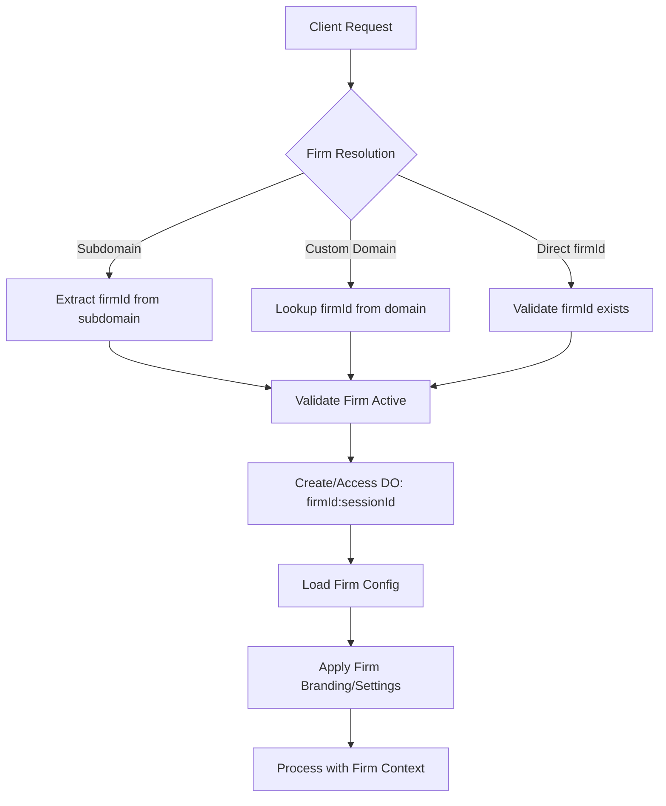

# Multi-Tenant Architecture Design for Engage

## Executive Summary

Transform the single-tenant Engage MVP into a commercially-ready multi-tenant SaaS platform while preserving the legal team's testing environment. This design ensures complete data isolation between law firms while maintaining the sophisticated conversation capabilities we've built.

## Current State Analysis

### ✅ What Works (Keep These!)
- **ConversationSession Durable Objects**: Solid session state management
- **MCP Server Architecture**: Goal tracking, conflict checking, additional goals
- **Claude AI Integration**: Professional conversation handling
- **Security Model**: Multi-phase authentication, resume tokens
- **Astro UI**: Streaming chat interface, mobile-responsive

### 🔄 What Needs Multi-Tenant Transformation
- **Data Isolation**: Currently all conversations share same namespace
- **Firm Configuration**: No firm-specific settings, branding, conflicts
- **User Management**: No firm admin roles or user segmentation
- **Billing Context**: No usage tracking per firm
- **Authentication**: Basic Auth0, needs firm-aware authentication

## Multi-Tenant Architecture Design

### 🏢 **Firm Entity Model**

```typescript
export interface Firm {
  firmId: string;           // ULID - Primary key
  name: string;             // "Smith & Associates Law"
  slug: string;             // "smith-associates" for subdomain
  domain?: string;          // Custom domain "intake.smithlaw.com"
  
  // Branding
  branding: {
    logoUrl?: string;
    primaryColor: string;   // "#1a2b3c"
    secondaryColor: string;
    fontFamily?: string;
  };
  
  // Practice Configuration
  practiceAreas: string[];  // ["personal_injury", "employment_law"]
  restrictions: string[];   // Areas they don't handle
  
  // Business Configuration
  subscription: {
    tier: 'starter' | 'professional' | 'enterprise';
    status: 'trial' | 'active' | 'suspended' | 'cancelled';
    trialEndsAt?: Date;
    monthlyConversationLimit: number;
    currentUsage: number;
  };
  
  // Compliance Settings
  compliance: {
    hipaaEnabled: boolean;
    retentionPolicyDays: number;
    allowAnonymousChats: boolean;
    requireAuth0Login: boolean;
  };
  
  // Admin Users
  adminUsers: string[];     // Auth0 user IDs with admin access
  
  // Metadata
  createdAt: Date;
  lastActive: Date;
  isActive: boolean;
}
```

### 🔐 **Data Isolation Strategy**

#### **1. Durable Object Naming Convention**
```typescript
// Current (single-tenant)
DO_NAME = sessionId

// New (multi-tenant)
DO_NAME = `${firmId}:${sessionId}`

// Examples:
// "firm_01HQZK8P2M7N3Q4R5S:session_01HQZK8P2M7N3Q4R5T"
// "firm_acme_law:session_car_accident_2024"
```

#### **2. Vectorize Index Isolation** 
**Strategy: Separate Indexes per Firm (Complete Physical Isolation)**

```typescript
// Current (shared indexes)
conflict-database
supporting-documents

// New (per-firm indexes) - RECOMMENDED APPROACH
conflict-database-${firmId}      // e.g., conflict-database-firm_abc123
supporting-documents-${firmId}   // e.g., supporting-documents-firm_abc123

// Automatic index creation when firm signs up
```

**Rationale Based on Cloudflare Research:**
- **Complete Isolation**: Physical separation prevents any cross-tenant data leakage
- **Performance**: 5M vector limit per index provides massive capacity per firm
- **Compliance**: Easier HIPAA/SOC 2 auditing with physical data separation
- **Global Scale**: Leverages Cloudflare's distributed architecture per firm
- **No Migration**: Clean start with test data only, no existing data to migrate

#### **3. Conversation State Enhancement**
```typescript
export interface ConversationState {
  // NEW: Firm context (added to existing structure)
  firmId: string;           // REQUIRED: Which firm owns this conversation
  firmConfig: FirmConfig;   // Cached firm settings for performance
  
  // Enhanced user identity with firm context
  userIdentity: {
    // ... existing fields ...
    firmSpecificData?: Record<string, unknown>; // Custom fields per firm
  };
  
  // Firm-specific goals and workflows
  firmWorkflow?: {
    customGoals: Goal[];
    workflowOverrides: Record<string, unknown>;
  };
}
```

### 🎯 **Multi-Tenant Request Flow**



### 🏗️ **New Multi-Tenant Components**

#### **1. FirmRegistry Durable Object**
**Purpose**: Central registry for all firms, domain routing, firm lookup
**Naming**: Single global instance `firm-registry`

```typescript
export class FirmRegistry implements DurableObject {
  // Methods:
  // - registerFirm(firmData: Firm): Promise<string>
  // - getFirmBySlug(slug: string): Promise<Firm | null>
  // - getFirmByDomain(domain: string): Promise<Firm | null>
  // - updateFirmConfig(firmId: string, config: Partial<Firm>): Promise<void>
  // - listActiveFirms(): Promise<Firm[]>
}
```

#### **2. FirmAdmin Durable Object**
**Purpose**: Per-firm administration, user management, analytics
**Naming**: `firm-admin:${firmId}`

```typescript
export class FirmAdmin implements DurableObject {
  // Methods:
  // - addAdminUser(auth0UserId: string): Promise<void>
  // - updateConflictList(conflicts: ConflictEntry[]): Promise<void>
  // - uploadSupportingDocument(doc: Document): Promise<string>
  // - getAnalytics(dateRange: DateRange): Promise<Analytics>
  // - manageSubscription(action: SubscriptionAction): Promise<void>
}
```

#### **3. Multi-Tenant MCP Servers**
**Enhancement**: Add firmId parameter to all MCP server calls

```typescript
// Current MCP calls
goalTracker.getGoals(sessionId)
conflictChecker.checkConflict(userIdentity)

// Multi-tenant MCP calls
goalTracker.getGoals(firmId, sessionId)
conflictChecker.checkConflict(firmId, userIdentity)
additionalGoals.search(firmId, query)
```

### 🌐 **URL and Routing Strategy**

#### **Development/Testing URLs**
```
# Current (single tenant)
https://d7fdb312.engage-ui.pages.dev/

# Multi-tenant options:
https://engage.lexara.com/demo/acme-law        # Path-based
https://acme-law.engage.lexara.com/            # Subdomain
https://intake.acmelaw.com/                    # Custom domain
```

#### **Firm Resolution Logic**
```typescript
function resolveFirmContext(request: Request): Promise<FirmContext> {
  const url = new URL(request.url);
  
  // 1. Check for subdomain
  const subdomain = extractSubdomain(url.hostname);
  if (subdomain && subdomain !== 'www') {
    return getFirmBySlug(subdomain);
  }
  
  // 2. Check for custom domain
  const firm = await getFirmByDomain(url.hostname);
  if (firm) return firm;
  
  // 3. Check path-based routing
  const pathFirm = extractFirmFromPath(url.pathname);
  if (pathFirm) return getFirmBySlug(pathFirm);
  
  // 4. Default/demo firm
  return getDefaultDemoFirm();
}
```

### 🔒 **Security and Access Control**

#### **Firm Data Isolation Rules**
1. **Durable Objects**: `firmId` prefix ensures physical isolation
2. **Vectorize Indexes**: Per-firm indexes prevent cross-firm data access
3. **API Routes**: All endpoints validate firmId before data access
4. **MCP Servers**: FirmId parameter required for all operations

#### **Admin Access Control**
```typescript
interface AdminPermissions {
  canManageUsers: boolean;
  canManageConflicts: boolean;
  canViewAnalytics: boolean;
  canManageBilling: boolean;
  canManageBranding: boolean;
}

// Role-based access within firms
type FirmRole = 'admin' | 'lawyer' | 'staff' | 'viewer';
```

### 📊 **Implementation Strategy (No Migration Needed)**

**Advantage: Clean Slate Implementation**
Since we only have test data, we can implement multi-tenancy from scratch without complex migration:

#### **Phase 1: Multi-Tenant Foundation (Week 1)**
- Implement FirmRegistry and firm resolution
- Create demo firms for development/testing  
- Add firmId to all new conversations
- Deploy alongside existing system for legal team testing

#### **Phase 2: Complete Isolation (Week 2)**  
- Implement per-firm Vectorize index creation
- Update MCP servers for firm-aware operations
- Add firm-specific configuration and branding
- Test complete data isolation

#### **Phase 3: Production Ready (Week 3-4)**
- Add subscription management and usage tracking
- Implement firm registration and admin interfaces
- Performance optimization and security hardening
- Deploy to production with multiple demo firms

### 🎛️ **Implementation Priority**

#### **Week 1: Foundation**
- [ ] Create Firm entity and FirmRegistry DO
- [ ] Implement firm resolution middleware
- [ ] Add firmId to ConversationState
- [ ] Update DO naming convention

#### **Week 2: Data Isolation**
- [ ] Implement per-firm Vectorize indexes
- [ ] Update MCP servers for multi-tenancy
- [ ] Add firm configuration caching
- [ ] Create FirmAdmin DO

#### **Week 3: Authentication & Admin**
- [ ] Implement firm-aware authentication
- [ ] Build basic admin dashboard
- [ ] Add firm registration flow
- [ ] Test complete isolation

#### **Week 4: Polish & Testing**
- [ ] Add firm branding support
- [ ] Implement usage tracking
- [ ] Performance optimization
- [ ] Security audit

## Testing Strategy

### **Isolation Testing**
```bash
# Test 1: Create two firms with identical data
# Verify complete isolation between firm_a and firm_b

# Test 2: Cross-firm access attempts
# Verify unauthorized access properly blocked

# Test 3: Performance under multi-tenant load
# Verify no performance degradation with multiple firms
```

### **Backward Compatibility**
```bash
# Test 4: Legal team testing environment
# Verify existing functionality unchanged during migration

# Test 5: Gradual migration
# Test existing conversations work with firmId defaults
```

## Success Metrics

### **Technical Requirements**
- ✅ **Complete Data Isolation**: Zero cross-firm data leakage
- ✅ **Performance**: No degradation vs single-tenant
- ✅ **Backward Compatibility**: Legal team testing unaffected
- ✅ **Scalability**: Support 1000+ firms on same infrastructure

### **Business Requirements**
- ✅ **Self-Service Signup**: Firms can register and configure independently
- ✅ **Usage Tracking**: Per-firm conversation and billing metrics
- ✅ **Admin Control**: Firm admins can manage their own settings
- ✅ **White-Label Ready**: Custom branding and domain support

This architecture transforms Engage from a proof-of-concept into a scalable commercial SaaS platform while preserving all the sophisticated AI and conversation capabilities we've built. The phased approach ensures we can ship quickly while maintaining quality and security.